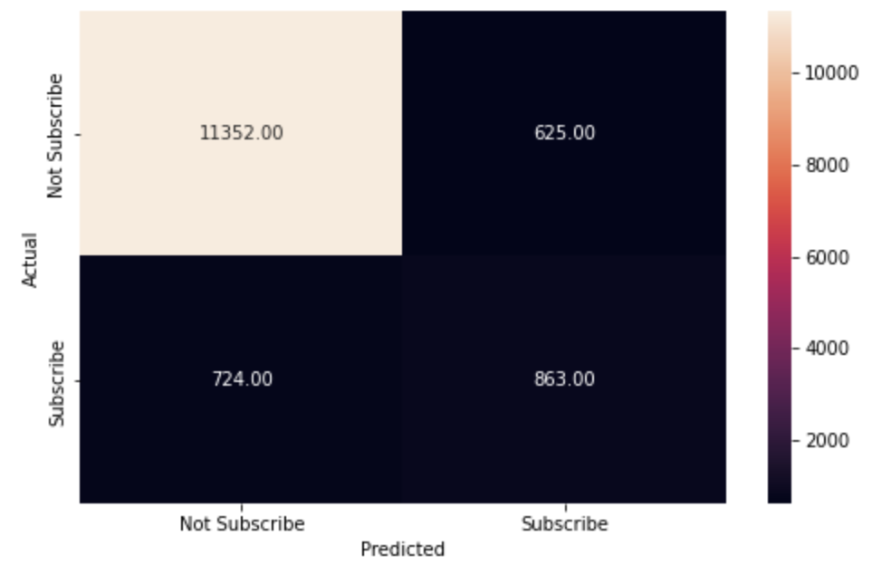
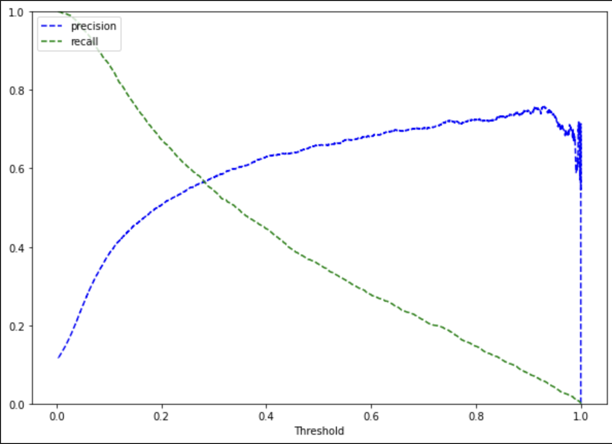
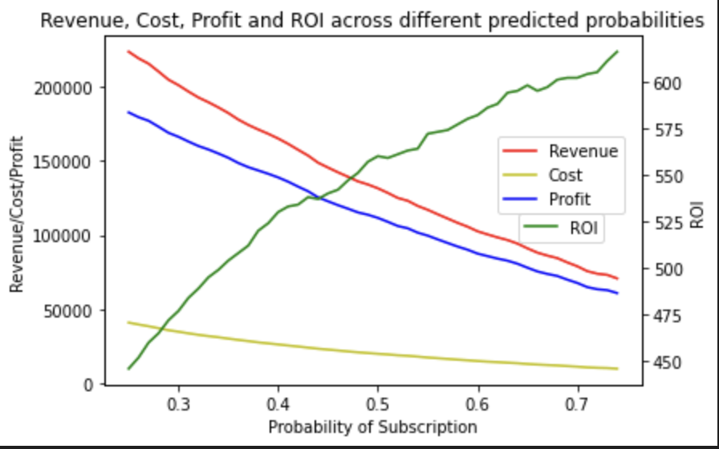

# 📈 Bank Marketing ROI Analysis (Logistic Regression)

This project uses **Logistic Regression** to predict whether a client will subscribe to a term deposit based on personal and campaign data from a **Portuguese banking institution**. It goes beyond classification by integrating **ROI analysis**, **profit-cost evaluation**, and **threshold optimization**, helping business teams maximize return on marketing campaigns.

---

## 🎯 Objective

- Predict subscription likelihood to term deposits
- Use threshold tuning to:
  - Improve marketing precision & recall
  - Maximize campaign **ROI** and **Profit**
  - Reduce cost by targeting only high-conversion customers

---

## 📊 Dataset Overview

- 📍 Source: [UCI ML Repository – Bank Marketing](https://archive.ics.uci.edu/ml/datasets/Bank+Marketing)
- 📈 Records: 45,211 customers
- 🔢 Target: `y` – Subscribed (`yes`/`no`)
- 🧩 Features include:
  - Customer: age, job, education, default, loan
  - Campaign: contact type, month, duration
  - Outcome: previous success, campaign frequency

---

## ⚙️ Tools & Libraries

- Python, Pandas, NumPy
- Scikit-learn (`LogisticRegression`, `precision_recall_curve`, etc.)
- Seaborn, Matplotlib

---

## 🧪 Modeling Approach

- **Preprocessing:**
  - Dummy encoding for categorical variables
  - Yes/No → 1/0 transformation
  - Feature scaling with `StandardScaler`

- **Modeling:**
  - Train/Test split with stratification (70/30)
  - Baseline logistic regression training
  - Threshold tuning via precision-recall curve

---

## 📈 Key Visualizations

### 🔹 Confusion Matrix at 0.30 Threshold

> Balanced performance: precision remains strong while recall improves noticeably

---

### 🔹 Precision vs Recall vs Threshold

> The model achieves optimal balance around **threshold = 0.30**

---

### 🔹 Revenue, Cost, Profit & ROI by Probability Threshold

> As threshold increases:
> - 🎯 Target population narrows
> - 💰 Revenue declines
> - 💹 ROI increases due to better targeting
> - 📊 Max profit is around threshold ~0.7, ROI peaks near ~0.5

---

## 💡 Key Business Insights

- Targeting **all customers** gives ~$53,000 in profit, but lower ROI
- Filtering by predicted probability > 0.5 gives **600% ROI**
- Precision-recall tuning helps align modeling with **business impact**, not just accuracy

---

## 🧠 Strategic Recommendations

- Use **0.5–0.7 probability threshold** to define high-potential targets
- Reduce unnecessary marketing spend by **ignoring low-probability customers**
- Monitor **precision-recall trade-offs** continuously across campaigns

---

## 👤 Author

**Rameen Mustafa**  
M.S. Business Analytics - Isenberg School of Management
University of Massachussetts Amherst

